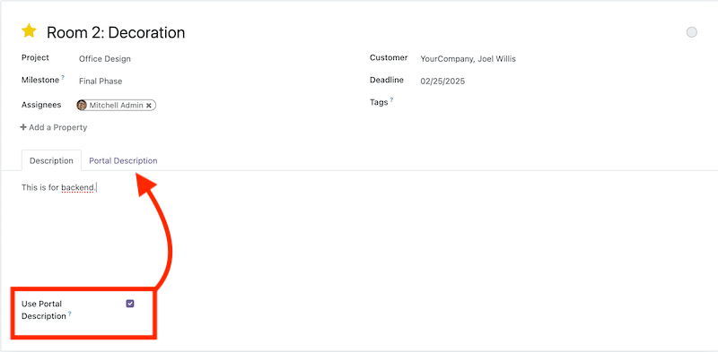
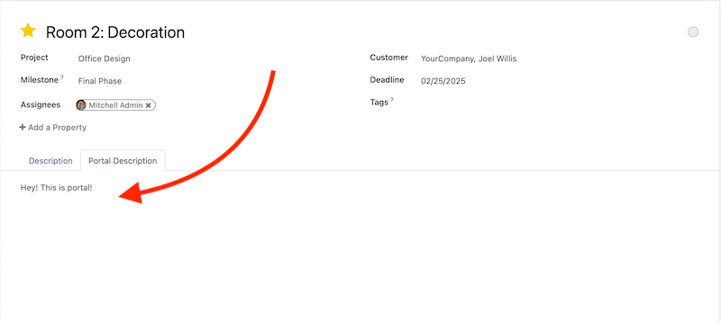
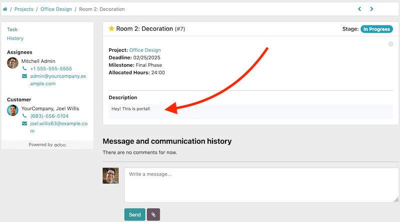

On the task form enable the "Use Portal Description" checkbox located in the "Description" tab of the notebook.

A new tab "Portal Description" will become visible. Put task description that you would like to show to portal users in that tab.

If "Use Portal Description" is disabled standard task description will be show to portal users as before. 

