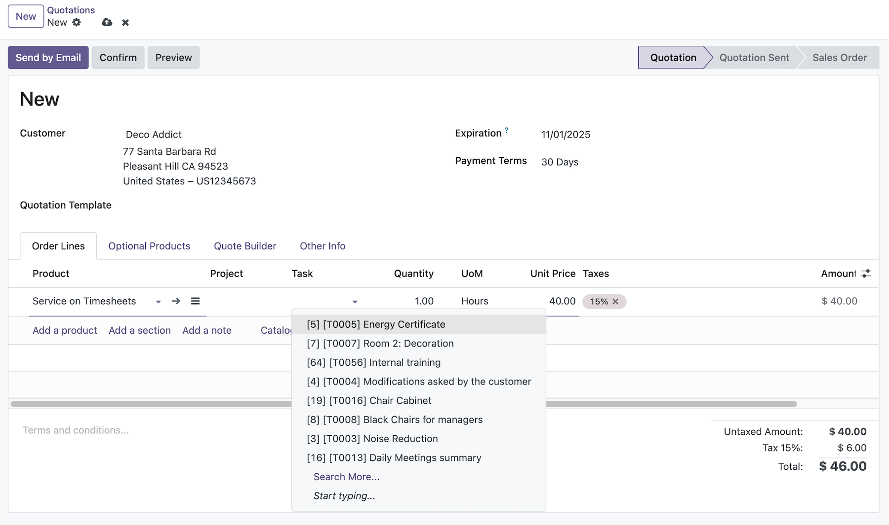

This module allows to manually select the Task or Project for a Sale Order Line, before its confirmation.

To do so, it displays the **Project** and **Task** fields in the order, and lets the user pre-define a value for Service Tracking lines.

Upon confirmation, if the Task or Project are set, the automatic creation will be skipped and they will be linked to the order instead.
